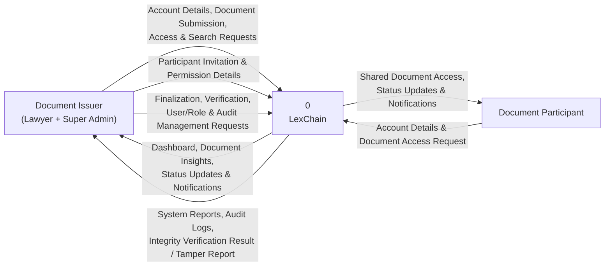
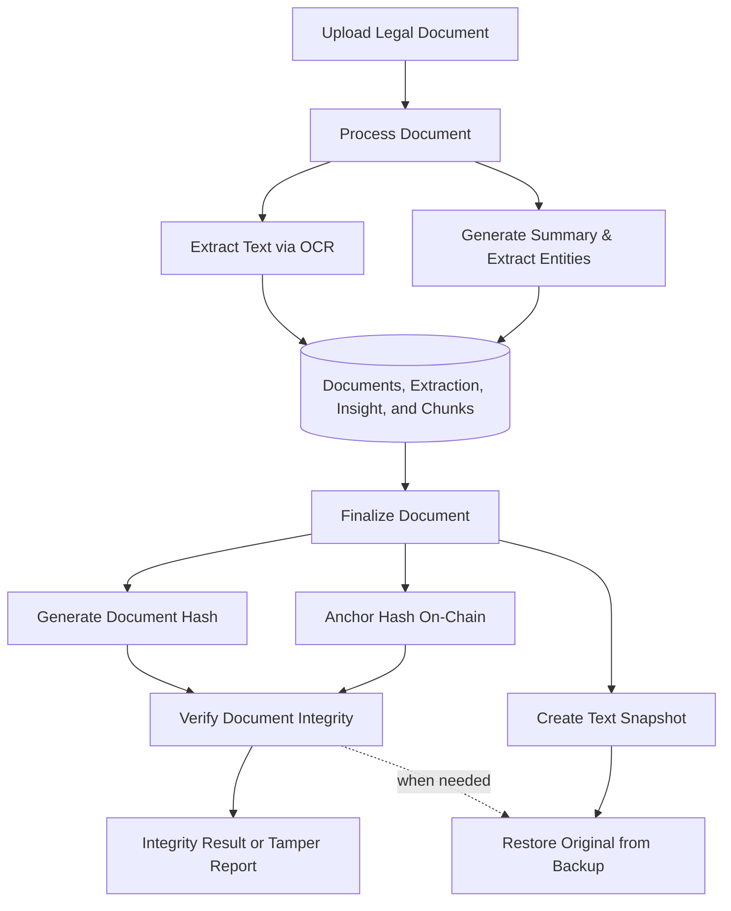

# LexChain Draw.io Target System Design

**Status:** Diagram-authoritative target design

**Audience:** Project team, developers, reviewers, and advisers

**Last updated:** 2026-07-26

## 1. Purpose

This document explains the target LexChain system defined by these three
updated diagrams:

- `docs/cfd_last.drawio`
- `docs/use_case_last.drawio`
- `docs/erd_last.drawio`

It includes features that may not be implemented yet. It does not use the
current application or API as authority for deciding what belongs in the target
system.

No actor, use case, data entity, or external system is added unless it appears
in one of the three diagrams.

## 2. Target-System Boundary

The Context Flow Diagram defines LexChain as one system with two external
actors:

1. **Document Issuer (Lawyer + Super Admin)**
2. **Document Participant**

The parenthetical `Lawyer + Super Admin` identifies the one Document Issuer
actor. It does not create roles, permission tiers, portal variants, or
navigation groups.

The diagrams do not define a Public Verifier, a separate third registered actor,
separate mobile/web applications, external identity service, email service,
object storage service, OCR provider, or blockchain provider as independent
architecture components. Those items are therefore outside this
diagram-authoritative target design.

## 3. Context Flow

### 3.1 Document Issuer inputs

The Document Issuer sends:

- account details;
- document submissions;
- document access requests;
- document search requests;
- participant invitations;
- participant permission details;
- document-finalization requests;
- document-verification requests;
- user and role management requests; and
- audit-management requests.

### 3.2 Document Issuer outputs

LexChain returns:

- dashboard information;
- document insights;
- document status updates;
- notifications;
- system reports;
- audit logs;
- integrity-verification results; and
- tamper reports.

### 3.3 Document Participant inputs

The Document Participant sends:

- account details; and
- document-access requests.

### 3.4 Document Participant outputs

LexChain returns:

- access to shared documents;
- document status updates; and
- notifications.

## 4. Actors and Use Cases

### 4.1 Document Issuer (Lawyer + Super Admin)

The use-case diagram connects the Document Issuer to:

1. Upload Legal Document
2. Rename Document
3. View Document Status
4. Manage Document Access
5. View Document Insights
6. Ask Questions
7. Search Documents
8. Finalize Document
9. Verify Document Integrity
10. Restore Original from Backup
11. Manage User Accounts
12. Manage Issuer Invitations
13. Generate Reports
14. View Audit Logs
15. View System Statistics
16. View Registered Users
17. View and Manage Notifications
18. Register Account
19. Log In

These are all part of the target system even if some are not implemented yet.

### 4.2 Document Participant

The use-case diagram connects the Document Participant to:

1. View and Manage Notifications
2. Register Account
3. Log In
4. View Shared Documents
5. View Document Details
6. Request Document E-Copy
7. Search Shared Documents

### 4.3 Included use cases

The use-case diagram defines these required inclusions:

- **Upload Legal Document** includes **Process Document**.
- **Process Document** includes **Extract Text via OCR**.
- **Process Document** includes **Generate Summary & Extract Entities**.
- **Finalize Document** includes **Generate Document Hash**.
- **Finalize Document** includes **Create Text Snapshot (Backup)**.
- **Finalize Document** includes **Anchor Hash On-Chain**.
- **Verify Document Integrity** includes **Generate Document Hash**.

An included use case is a required part of its parent flow.

### 4.4 Extended use cases

The use-case diagram defines:

- **Forgot Password** extends **Log In**.
- **Restore Original from Backup** extends **Verify Document Integrity**.

These flows occur only when their triggering condition applies.

## 5. Functional Architecture

The diagram use cases group into eight necessary functional areas. These are
logical responsibilities inside LexChain, not separate applications or
services.

| Functional area | Responsibilities from the diagrams |
|---|---|
| Account access | Register Account, Log In, Forgot Password |
| Document intake | Upload Legal Document, Rename Document, View Document Status |
| Document processing | Process Document, Extract Text via OCR, Generate Summary & Extract Entities |
| Document intelligence | View Document Insights, Ask Questions, Search Documents, Search Shared Documents |
| Access and participation | Manage Document Access, invitations, permissions, View Shared Documents, View Document Details |
| Finalization and integrity | Finalize Document, Generate Document Hash, Create Text Snapshot, Anchor Hash On-Chain, Verify Document Integrity, Restore Original from Backup |
| Administration and reporting | Manage User Accounts, Manage Issuer Invitations, Generate Reports, View Audit Logs, View System Statistics, View Registered Users |
| Requests and notifications | Request Document E-Copy, View and Manage Notifications |

The implementation may organize these responsibilities into modules, but the
diagrams do not require independent deployable services.

## 6. User Workflows

### 6.1 Account registration and login

### Document Issuer

1. The Document Issuer registers an account.
2. The Document Issuer logs in.
3. If the password is forgotten, the Forgot Password extension is used.
4. LexChain returns account access and the appropriate dashboard.

### Document Participant

1. The Document Participant registers an account.
2. The Document Participant logs in.
3. If the password is forgotten, the Forgot Password extension is used.
4. LexChain returns access to participant functions.

### 6.2 Document upload and processing

1. The Document Issuer uploads a legal document.
2. Upload Legal Document invokes Process Document.
3. Process Document extracts text through OCR.
4. Process Document performs Generate Summary & Extract Entities.
5. LexChain stores the document and processing results.
6. LexChain returns document status and document insights.

The target is incomplete if upload succeeds without its required processing
steps.

### 6.3 Document management and intelligence

1. The Document Issuer opens a document.
2. The issuer may rename it.
3. The issuer views its status.
4. The issuer views generated document insights.
5. The issuer searches documents or asks questions about document content.
6. LexChain returns results derived from the stored document, extraction,
   insight, and chunk data.

### 6.4 Participant invitation and access

1. The Document Issuer manages document access.
2. The issuer provides participant invitation and permission details.
3. LexChain records the document-party relationship.
4. The Document Participant requests or receives access.
5. LexChain grants shared-document access according to the recorded permission.
6. The participant views shared documents and document details.
7. The participant searches only shared documents.
8. LexChain sends relevant status updates and notifications.

### 6.5 Document finalization

1. The Document Issuer starts Finalize Document.
2. LexChain generates the document hash.
3. LexChain creates a text snapshot as a backup.
4. LexChain anchors the hash on-chain.
5. LexChain records finalization details and on-chain information.
6. LexChain returns the final document status.

The three included operations are required parts of finalization.

### 6.6 Integrity verification

1. The Document Issuer starts Verify Document Integrity.
2. LexChain generates the current document hash.
3. LexChain compares the current hash with the stored integrity record.
4. LexChain returns an integrity-verification result or tamper report.
5. When restoration is needed, Restore Original from Backup extends the
   verification flow.
6. LexChain uses the stored text snapshot for the restoration flow.

### 6.7 Document e-copy request

1. The Document Participant opens a shared document.
2. The participant submits Request Document E-Copy.
3. LexChain records the request.
4. The responsible Document Issuer reviews the request.
5. LexChain records the resulting status.
6. The participant receives a notification.

The review step is implied by the ERD fields `lawyer_id`, `status`, and
`rejection_reason`. `lawyer_id` is the raw ERD schema field name for the
responsible Document Issuer; it does not define a separate Lawyer role.

### 6.8 Notifications

1. LexChain creates a notification for a relevant account or document event.
2. The Document Issuer or Document Participant views notifications.
3. The user may mark a notification as read.
4. LexChain preserves read status and event metadata.

### 6.9 Administration and reporting

The Document Issuer uses the ordinary **System Management** capability set:

1. manage user accounts;
2. manage issuer invitations;
3. view registered users;
4. view system statistics;
5. generate system reports;
6. view audit logs; and
7. receive audit and system-management results from LexChain.

## 7. Data Architecture

The ERD defines fourteen tables. They are the complete diagram-authoritative
data scope.

### 7.1 `users`

Purpose: user account, role, profile, verification, and MFA data.

| Key | Field | Type |
|---|---|---|
| PK | `id` | UUID |
| UK | `supabase_user_id` | VARCHAR(255) |
| UK | `email` | VARCHAR(255) |
|  | `f_name` | VARCHAR(255) |
|  | `l_name` | VARCHAR(255) |
|  | `is_active` | BOOLEAN |
|  | `is_email_verified` | BOOLEAN |
|  | `user_metadata` | JSON |
|  | `role` | VARCHAR(50) |
|  | `avatar` | VARCHAR(500) |
|  | `mfa_enabled` | BOOLEAN |
|  | `totp_secret` | VARCHAR(32) |
|  | `updated_at` | TIMESTAMP |
|  | `created_at` | TIMESTAMP |

### 7.2 `invitations`

Purpose: issuer invitations, tokens, status, expiry, and claim ownership.

| Key | Field | Type |
|---|---|---|
| PK | `id` | UUID |
| UK | `email` | VARCHAR(255) |
|  | `role` | VARCHAR(50) |
| UK | `token` | VARCHAR(255) |
|  | `status` | VARCHAR(50) |
|  | `expires_at` | TIMESTAMP |
| FK | `claimed_by` | UUID |
|  | `created_at` | TIMESTAMP |
|  | `updated_at` | TIMESTAMP |

### 7.3 `books`

Purpose: document-book grouping owned by a user.

| Key | Field | Type |
|---|---|---|
| PK | `id` | UUID |
| FK | `user_id` | UUID |
|  | `book_number` | VARCHAR(50) |
|  | `series_year` | INTEGER |
|  | `created_at` | TIMESTAMP |
|  | `updated_at` | TIMESTAMP |

### 7.4 `documents`

Purpose: document ownership, storage, book placement, hashes, lifecycle, and
finalization state.

| Key | Field | Type |
|---|---|---|
| PK | `id` | UUID |
| FK | `user_id` | UUID |
|  | `file_name` | VARCHAR(255) |
|  | `storage_url` | VARCHAR(500) |
|  | `status` | VARCHAR(50) |
|  | `on_chain` | BOOLEAN |
|  | `document_hash` | VARCHAR(500) |
|  | `content_hash` | VARCHAR(500) |
|  | `content_type` | VARCHAR(50) |
|  | `created_at` | TIMESTAMP |
|  | `updated_at` | TIMESTAMP |
| FK | `book_id` | UUID |
|  | `document_number` | INTEGER |
|  | `page_number` | INTEGER |
|  | `lifecycle` | VARCHAR(20) |
|  | `finalized_at` | TIMESTAMP |
| FK | `finalized_by` | UUID, nullable |

### 7.5 `document_parties`

Purpose: participant access and document-level role.

| Key | Field | Type |
|---|---|---|
| PK | `id` | UUID |
| FK | `document_id` | UUID |
| FK | `user_id` | UUID |
|  | `email` | VARCHAR(255) |
|  | `email` | VARCHAR(255) |
|  | `role` | VARCHAR(50) |
|  | `created_at` | TIMESTAMP |
|  | `updated_at` | TIMESTAMP |

The ERD contains `email` twice in this table. This document preserves that
as-drawn duplication instead of silently choosing a replacement. The ERD must
be corrected before database implementation if only one email field is
intended.

### 7.6 `document_extraction`

Purpose: OCR output and extraction measurements.

| Key | Field | Type |
|---|---|---|
| PK | `id` | UUID |
| FK | `document_id` | UUID |
|  | `engine` | VARCHAR(50) |
|  | `engine_version` | VARCHAR(50) |
|  | `text` | TEXT |
|  | `page_count` | INTEGER |
|  | `confidence_avg` | FLOAT |
|  | `meta` | JSONB |
|  | `created_at` | TIMESTAMP |

### 7.7 `document_insight`

Purpose: generated summary, entities, labels, risk flags, and confidence.

| Key | Field | Type |
|---|---|---|
| PK | `id` | UUID |
| FK | `document_id` | UUID |
| FK | `extraction_id` | UUID |
|  | `engine` | VARCHAR(50) |
|  | `engine_version` | VARCHAR(50) |
|  | `summary` | TEXT |
|  | `labels` | JSONB |
|  | `entities` | JSONB |
|  | `risk_flags` | JSONB |
|  | `confidence` | FLOAT |
|  | `meta` | JSONB |
|  | `created_at` | TIMESTAMP |

### 7.8 `document_chunks`

Purpose: text chunks and embeddings used by document search and questions.

| Key | Field | Type |
|---|---|---|
| PK | `id` | UUID |
| FK | `document_id` | UUID |
| FK | `extraction_id` | UUID |
|  | `chunk_index` | INTEGER |
|  | `text` | TEXT |
|  | `char_count` | INTEGER |
|  | `embedding` | JSONB |
|  | `embedding_vec` | VECTOR(384) |
|  | `strategy` | VARCHAR(50) |
|  | `engine` | VARCHAR(50) |
|  | `engine_version` | VARCHAR(50) |
|  | `meta` | JSONB |
|  | `created_at` | TIMESTAMP |

### 7.9 `document_snapshots`

Purpose: finalization-time text backup and verification hash.

| Key | Field | Type |
|---|---|---|
| PK | `id` | UUID |
| FK | `document_id` | UUID |
|  | `text` | TEXT |
|  | `text_hash` | VARCHAR(64) |
|  | `created_at` | TIMESTAMP |

### 7.10 `on_chain_records`

Purpose: anchored document integrity data.

| Key | Field | Type |
|---|---|---|
| PK | `id` | UUID |
| FK | `document_id` | UUID |
|  | `tx_hash` | VARCHAR(66) |
|  | `onchain_document_id` | VARCHAR(255) |
|  | `data_hash` | VARCHAR(500) |
|  | `onchain_timestamp` | BIGINT |
|  | `issued_by` | VARCHAR(42) |
|  | `created_at` | TIMESTAMP |
|  | `updated_at` | TIMESTAMP |

### 7.11 `document_requests`

Purpose: participant document e-copy requests and issuer decisions.

| Key | Field | Type |
|---|---|---|
| PK | `id` | UUID |
| FK | `requester_id` | UUID |
|  | `requester_email` | VARCHAR(255) |
|  | `requester_name` | VARCHAR(255) |
| FK | `document_id` | UUID |
|  | `description` | TEXT |
|  | `status` | VARCHAR(50) |
| FK | `lawyer_id` | UUID |
|  | `rejection_reason` | TEXT |
|  | `created_at` | TIMESTAMP |
|  | `updated_at` | TIMESTAMP |

### 7.12 `notifications`

Purpose: account notifications and read state.

| Key | Field | Type |
|---|---|---|
| PK | `id` | UUID |
| FK | `user_id` | UUID |
|  | `type` | ENUM |
|  | `title` | VARCHAR(255) |
|  | `body` | TEXT |
|  | `is_read` | BOOLEAN |
|  | `event_metadata` | JSON |
|  | `created_at` | TIMESTAMP |
|  | `updated_at` | TIMESTAMP |

### 7.13 `document_audit_logs`

Purpose: document-specific action history.

| Key | Field | Type |
|---|---|---|
| PK | `id` | UUID |
| FK | `document_id` | UUID |
| FK | `user_id` | UUID, nullable |
|  | `action` | VARCHAR(100) |
|  | `details` | JSON |
|  | `created_at` | TIMESTAMP |
|  | `updated_at` | TIMESTAMP |

### 7.14 `system_audit_logs`

Purpose: system-level user, role, and administrative action history.

| Key | Field | Type |
|---|---|---|
| PK | `id` | UUID |
| FK | `user_id` | UUID, nullable |
|  | `action` | VARCHAR(100) |
|  | `target_type` | VARCHAR(50) |
|  | `target_id` | VARCHAR(255) |
|  | `details` | JSON |
|  | `ip_address` | VARCHAR(45) |
|  | `user_agent` | VARCHAR(255) |
|  | `created_at` | TIMESTAMP |
|  | `updated_at` | TIMESTAMP |

## 8. ERD Relationships

The foreign-key fields define these direct relationships:

- `notifications.user_id` → `users.id`
- `invitations.claimed_by` → `users.id`
- `books.user_id` → `users.id`
- `documents.user_id` → `users.id`
- `documents.book_id` → `books.id`
- `documents.finalized_by` → `users.id`
- `document_parties.document_id` → `documents.id`
- `document_parties.user_id` → `users.id`
- `document_extraction.document_id` → `documents.id`
- `document_insight.document_id` → `documents.id`
- `document_insight.extraction_id` → `document_extraction.id`
- `document_chunks.document_id` → `documents.id`
- `document_chunks.extraction_id` → `document_extraction.id`
- `document_snapshots.document_id` → `documents.id`
- `on_chain_records.document_id` → `documents.id`
- `document_requests.requester_id` → `users.id`
- `document_requests.document_id` → `documents.id`
- `document_requests.lawyer_id` → `users.id`
- `document_audit_logs.document_id` → `documents.id`
- `document_audit_logs.user_id` → `users.id`
- `system_audit_logs.user_id` → `users.id`

Do not introduce additional relationship tables unless the ERD is updated.

## 9. Target Processing Flow

This flow does not require separate network services. It describes system
behavior only.

## 10. Anti-Overengineering Rules

These rules keep implementation limited to the target shown in the diagrams.

### 10.1 No unlisted product features

Do not add a new actor or use case unless the use-case diagram is updated and
approved.

Examples currently outside this diagram target:

- Public Verifier;
- a separate third registered actor;
- billing or payments;
- real-time collaborative editing;
- digital-signature workflows;
- chat between users;
- generic file management unrelated to legal documents; and
- custom analytics beyond Generate Reports and View System Statistics.

### 10.2 No unlisted data model

Use the fourteen ERD tables first. Add a table only when:

1. a required diagram use case cannot be represented safely;
2. the relationship cannot be expressed with an existing table; and
3. the ERD is updated before implementation.

### 10.3 Logical modules are enough

Account access, document processing, intelligence, integrity, access,
notifications, and administration may be modules in one application. The
diagrams do not require microservices, an event bus, a service mesh, or
independent deployments.

### 10.4 Reuse existing fields and flows

- Use `documents.status` and `documents.lifecycle` for document state.
- Use `document_parties` for document access.
- Use `document_requests` for e-copy requests.
- Use `notifications` for user event messages.
- Use `document_audit_logs` and `system_audit_logs` for history.
- Use `document_extraction`, `document_insight`, and `document_chunks` for OCR,
  insights, search, and questions.
- Use `document_snapshots` for text backup.
- Use `on_chain_records` for integrity anchoring.

Do not create parallel tables or workflows for the same responsibility.

### 10.5 Implement the smallest complete path

Build in this order:

1. Register Account and Log In
2. Upload and Process Document
3. View Status and Insights
4. Manage Access and Shared Documents
5. Search Documents and Ask Questions
6. Finalize, Snapshot, Anchor, and Verify
7. Restore from Backup
8. Request Document E-Copy
9. Notifications
10. User, Invitation, Report, Statistics, and Audit management

Each stage should use the existing target actors and ERD before introducing new
architecture.

## 11. Scope-Change Rule

A proposed change belongs in this target only when it answers all five:

1. Which of the two diagram actors uses it?
2. Which existing diagram use case requires it?
3. Which ERD table stores its necessary state?
4. Which existing flow produces its result?
5. Can the system work without adding a new component?

If the first four answers are missing, the proposal is outside the approved
diagram target. If the fifth answer is yes, reuse the existing architecture.

## 12. Definition of Complete

The diagram target is complete when:

- both actors can register and log in;
- the Document Issuer can upload, process, rename, search, inspect, finalize,
  verify, restore, share, administer, and report;
- the Document Participant can access, inspect, and search shared documents and
  request an e-copy;
- upload always includes OCR and insight generation;
- finalization always includes hashing, text snapshot creation, and on-chain
  anchoring;
- verification generates a current hash and returns an integrity result or
  tamper report;
- notifications, document audit logs, and system audit logs record their
  diagram-defined activity;
- all fourteen ERD tables have their defined responsibilities and
  relationships; and
- no additional actors, features, tables, or infrastructure are treated as
  required without first updating the diagrams.
