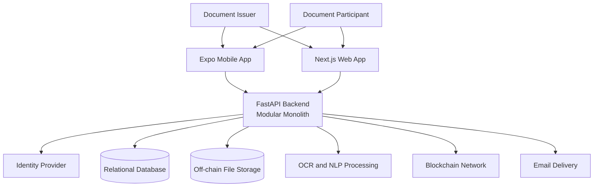
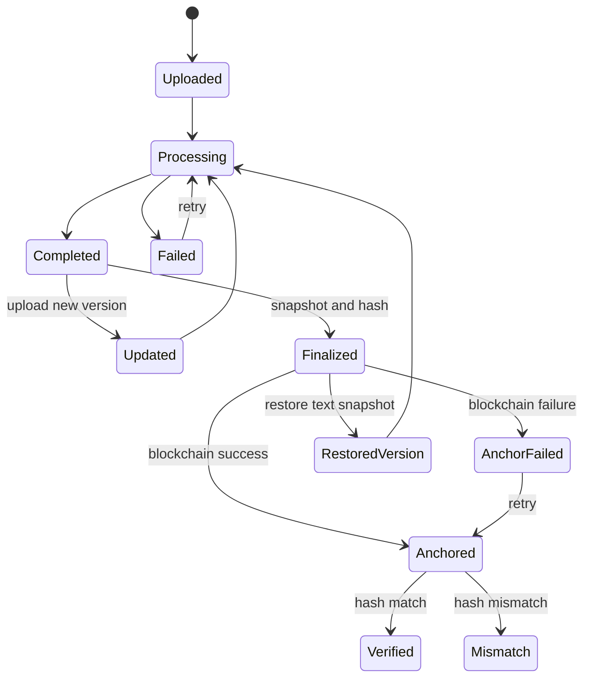

# LexChain Expanded System Architecture Reference

**Status:** Expanded reference; not a diagram-only target specification

**Audience:** Project team, developers, reviewers, and advisers

**Last updated:** 2026-07-26

> This document expands beyond the three updated Draw.io diagrams by adding
> implementation, security, deployment, testing, and current-system decisions.
> For the target system defined strictly by the diagrams, use
> `docs/LEXCHAIN-DRAWIO-TARGET-SYSTEM-DESIGN.md`.

## 1. Purpose

This document is an expanded architecture reference for LexChain. It combines
the diagram target with implementation-oriented decisions while avoiding
features or infrastructure that the product does not need.

It answers four questions:

1. Who uses LexChain?
2. What can each user do?
3. How does information move through the system?
4. What boundaries keep the implementation secure and maintainable?

This is a target design, not an implementation-status report. A feature in this
document describes the intended system behavior. Delivery status must be tracked
separately.

## 2. Source of Truth

This design consolidates and corrects the intent of:

- `docs/cfd_last.drawio`
- `docs/erd_last.drawio`
- `docs/use_case_last.drawio`
- `openapi-updated.json`
- the existing Expo mobile and Next.js web applications

When these sources disagree, use the following order:

1. The approved Draw.io target for actors, use cases, and system boundaries
2. This architecture for implementation-oriented decisions
3. The OpenAPI contract for backend request and response shapes
4. The ERD for persistent data relationships
5. Application code for current implementation behavior

The diagrams should be updated when this document changes materially.

## 3. Product Scope

LexChain is a legal-document management and integrity-verification system.

The system must allow authorized users to:

- register and sign in;
- upload and organize legal documents;
- process document text through OCR and NLP;
- view extracted text, summaries, entities, and document status;
- search documents and ask questions about their content;
- share document access with participants;
- request and review digital document-copy requests;
- finalize documents and preserve a text snapshot;
- record document hashes on-chain;
- verify whether a document still matches its recorded hash;
- receive relevant notifications;
- inspect document and system audit history; and
- administer users, issuer invitations, and system activity.

The public must be able to verify a PDF without receiving access to private
document content.

### 3.1 Non-goals

LexChain is not:

- a blockchain file-storage system;
- proof that a document is legally valid;
- a replacement for a lawyer or legal review;
- a general-purpose content-management system;
- a real-time collaborative document editor;
- an accounting, billing, or payment platform;
- a custom identity provider;
- a data warehouse;
- a microservice platform; or
- a system that requires a separate service for every feature.

Blockchain proves that a compared hash matches or does not match a recorded
hash. It does not prove authorship, truthfulness, enforceability, or legal
validity.

## 4. Design Principles

### 4.1 Backend authority

The backend is the source of truth for authentication, authorization, document
ownership, permissions, processing state, finalization, audit history, and
blockchain records.

Frontend checks improve the user experience but never grant final access.

### 4.2 One system, clear clients

Expo mobile and Next.js web are clients of the same backend. They may present
different interfaces, but they must not create separate business rules.

### 4.3 Modular monolith first

The backend should remain one deployable application with modules for:

- authentication and users;
- documents and books;
- document access and invitations;
- OCR/NLP processing;
- document requests;
- notifications;
- blockchain operations; and
- administration and audit.

These are code boundaries, not separate network services.

### 4.4 Store files off-chain

Original files belong in object/file storage. The relational database stores
metadata and relationships. The blockchain stores only the minimum integrity
proof required for verification.

### 4.5 Immutable history

Updating or restoring a document creates a new version or recorded state. The
system must not silently overwrite finalized history, audit logs, or blockchain
records.

### 4.6 Add complexity only after evidence

Do not add a cache, queue product, search cluster, second database, event bus,
microservice, or abstraction layer because it might be useful later. Add one
only when a measured problem cannot be solved safely inside the current design.

## 5. Users and Permissions

LexChain has exactly two registered actors.

| Registered actor | Canonical role | Main responsibility |
|---|---|---|
| Document Issuer | `document_issuer` | Performs all 19 diagram-assigned issuer use cases, including System Management |
| Document Participant | `document_participant` | Performs the 7 diagram-assigned shared-document use cases |

The diagram parenthetical `Lawyer + Super Admin` identifies the one Document
Issuer actor. It does not create a role, permission tier, portal variant, or
navigation group. Anonymous PDF verification is a public feature, not a
registered actor.

### 5.1 Role boundary

The backend returns only the canonical role values above. Every Document Issuer
receives the complete issuer capability set, including User Accounts, Issuer
Invitations, System Reports, Audit Logs, and System Statistics. Document
ownership and document-level authorization remain separate checks; issuer
status does not grant access to every document.

### 5.2 Document-level permissions

Document participation is separate from the account role. A document party may
receive one of these permissions:

- `viewer`: view the shared document and its allowed details;
- `signer`: view and perform signing-related actions when signing is supported;
- `editor`: perform explicitly allowed document updates.

The document owner controls party access. The backend validates every action
against both the account role and the document-level permission.

### 5.3 Minimum access matrix

| Capability | Document Issuer | Document Participant |
|---|---:|---:|
| Upload Legal Document | Yes | No |
| Rename Document | Yes | No |
| View Document Status | Yes | No |
| Manage Document Access | Yes | No |
| View Document Insights | Yes | No |
| Ask Questions | Yes | No |
| Search Documents | Yes | No |
| Finalize Document | Yes | No |
| Verify Document Integrity | Yes | No |
| Restore Original from Backup | Yes | No |
| Manage User Accounts | Yes | No |
| Manage Issuer Invitations | Yes | No |
| Generate Reports | Yes | No |
| View Audit Logs | Yes | No |
| View System Statistics | Yes | No |
| View Registered Users | Yes | No |
| View and Manage Notifications | Yes | Yes |
| Register Account | Yes | Yes |
| Log In | Yes | Yes |
| View Shared Documents | No | Yes |
| View Document Details | No | Yes |
| Request Document E-Copy | No | Yes |
| Search Shared Documents | No | Yes |

Public PDF verification is available without a registered account and is not a
role in this matrix.

## 6. System Context

The clients never connect directly to the database, object storage, OCR/NLP
engine, or blockchain with privileged credentials.

## 7. Component Responsibilities

### 7.1 Expo mobile application

The mobile application provides the portable document workflow:

- registration, sign-in, MFA, and password recovery;
- dashboard and notifications;
- owned and shared document lists;
- file upload and camera capture;
- upload and processing progress;
- document details, PDF viewing, and version history;
- document parties and invitations;
- document search and question answering;
- document-copy requests;
- internal integrity verification; and
- profile and security settings.

Mobile uses backend APIs for server state. It must not contain independent
authorization or cryptographic business rules.

### 7.2 Next.js web application

The web application owns:

- marketing and legal pages;
- public PDF verification;
- account registration, sign-in, MFA, and password recovery;
- the Document Issuer and Document Participant portal;
- upload, document management, search, requests, notifications, reports, and
  verification screens;
- the Document Issuer System Management destinations; and
- server-side route handlers that safely proxy browser requests to the backend.

Sensitive browser operations go through route handlers so backend credentials
and privileged tokens are not exposed to client components.

### 7.3 FastAPI backend

The backend:

- validates all inputs at the API boundary;
- authenticates users and evaluates permissions;
- coordinates document storage and database writes;
- computes cryptographic hashes;
- controls OCR/NLP processing;
- manages document versions, finalization, and snapshots;
- manages document parties and invitations;
- records and verifies blockchain proofs;
- creates notifications;
- records audit events; and
- exposes administration data.

### 7.4 Relational database

The database stores structured, queryable system state. Transactions must keep
related records consistent, especially during:

- document upload metadata creation;
- party invitation acceptance or rejection;
- document finalization;
- document-request review;
- blockchain-record creation; and
- audit-log creation.

### 7.5 Off-chain file storage

File storage contains uploaded PDFs and generated file versions. Database
records contain storage references, never duplicated file bodies.

Files are private by default. Access must use an authorized backend response or
a short-lived signed URL.

### 7.6 OCR and NLP processing

OCR/NLP processing produces:

- extracted text;
- extraction confidence and risk flags;
- summaries;
- recognized entities;
- searchable text chunks; and
- embeddings used by semantic search and document questions.

Processing may run in a background task inside the backend deployment. A
separate worker or queue is required only when real workload measurements show
that in-process work is unreliable or blocks normal API traffic.

### 7.7 Blockchain integration

The blockchain module:

- records the final document hash;
- stores transaction and on-chain identifiers;
- reads the recorded proof; and
- compares the current hash against the recorded hash.

It must not store full documents, extracted text, personal data, or access
permissions.

### 7.8 Email delivery

Email is used for:

- email verification;
- password recovery;
- issuer invitations;
- participant invitations when applicable;
- document-request notifications; and
- security-relevant account messages.

Email delivery failure must not falsely report that an invitation or reset
message was successfully delivered.

## 8. Core Data Model

The ERD defines fourteen target tables. Keep these tables focused on their
current responsibilities.

| Table | Responsibility |
|---|---|
| `users` | Application profile, account role, identity-provider link, and MFA state |
| `invitations` | Document Issuer invitations and claim state |
| `books` | Physical register/book grouping owned by a Document Issuer |
| `documents` | Current document/version metadata, owner, book, storage reference, status, and hashes |
| `document_parties` | Document access invitations and permissions |
| `document_extraction` | OCR output, confidence, page count, and processing metadata |
| `document_insight` | Summary, entities, labels, and NLP metadata |
| `document_chunks` | Searchable text chunks and embeddings |
| `document_snapshots` | Finalization-time extracted-text backup and text hash |
| `on_chain_records` | Blockchain identifiers, stored hash, transaction hash, and timestamp |
| `document_requests` | Digital-copy requests and issuer review state |
| `notifications` | User-specific notification state |
| `document_audit_logs` | Append-only actions for one document |
| `system_audit_logs` | Append-only administrative and security activity |

### 8.1 Essential relationships

- A user may own many books.
- A book belongs to one Document Issuer.
- A book may contain many documents.
- A document belongs to one Document Issuer and may have many versions.
- A document may have many parties.
- A document may have extraction, insight, chunks, snapshots, audit logs, and
  on-chain records.
- A user may submit many document requests.
- A user may receive many notifications.
- System audit entries identify the acting user when one exists.

### 8.2 Data rules

- Use UUIDs for application records unless an external system requires another
  identifier.
- Keep email unique at the application boundary.
- Keep audit logs append-only.
- Keep document hashes deterministic and identify the hashing algorithm.
- Do not store authentication passwords in LexChain tables.
- Do not store raw MFA secrets in logs or API responses.
- Do not store duplicate copies of a PDF in the relational database.
- Do not add generic metadata tables when a typed column already represents the
  required value.

## 9. User Workflows

### 9.1 Registration and sign-in

1. The user opens the mobile or web application.
2. The user registers with the required identity details or follows a valid
   invitation.
3. The identity provider verifies the email.
4. The backend creates or links the application profile.
5. The user signs in.
6. If MFA is enabled, the user completes the MFA challenge.
7. The backend returns an authenticated session.
8. The client routes the user according to the backend's canonical
   `document_issuer` or `document_participant` role.

The client must not select its own role or treat a client-readable role hint as
authorization. Document Issuer access requires an authenticated backend profile
with the `document_issuer` role.

### 9.2 Password recovery

1. The user enters the account email.
2. The backend or identity provider creates a single-use, expiring reset link.
3. The system returns the same neutral response whether the email exists or not.
4. The user follows the link and sets a valid new password.
5. Existing sessions are revoked when required by the security policy.
6. The system records the security event without recording the password or
   reset token.

### 9.3 Document upload and processing

1. A Document Issuer selects one PDF or captures document pages.
2. The client validates basic file type, size, title, and register-book input.
3. The backend repeats all validation.
4. The backend creates the document record and stores the file off-chain.
5. The backend computes the file hash.
6. OCR extracts text when required.
7. NLP generates the summary, entities, labels, chunks, and embeddings.
8. The backend updates the processing status.
9. The user sees progress, completion, or an actionable failure.

Uploading does not automatically prove legal validity or record the document
on-chain.

### 9.4 Document organization

1. The Document Issuer creates or selects a register book.
2. Uploaded documents are associated with that book.
3. The issuer can rename a document without changing the underlying file hash.
4. A new file creates a new document version rather than overwriting history.
5. Authorized users can inspect the version chain.

### 9.5 Document access invitation

1. The document owner enters a participant email and permission.
2. The backend validates the owner, target user, permission, and duplicate state.
3. The backend creates a pending document-party invitation.
4. The participant receives a notification.
5. The participant accepts or rejects the invitation.
6. Acceptance grants the recorded document permission.
7. Rejection keeps the document inaccessible.
8. The owner may later revoke access.
9. Every change is written to the document audit log.

### 9.6 Viewing and searching documents

1. The authenticated user opens owned or shared documents.
2. The backend filters the list according to ownership and accepted access.
3. The user opens document details, extracted insight, versions, and permitted
   audit information.
4. Search operates only across documents the user can access.
5. Question answering uses only chunks belonging to authorized documents.
6. The response identifies when the document does not contain enough evidence
   to answer.

Search and question answering must not leak chunks from inaccessible documents.

### 9.7 Document finalization

1. The owner reviews the completed document and extracted text.
2. The backend confirms that processing is complete and no incompatible update
   is in progress.
3. The backend recomputes the document hash.
4. The backend stores an extracted-text snapshot and its text hash.
5. The backend marks the document finalized.
6. The backend requests blockchain anchoring.
7. The system records the blockchain result and audit event.

If blockchain anchoring fails, the finalized document remains recorded with a
clear `pending` or `failed` blockchain state. Retrying anchoring must not create
multiple conflicting proofs.

### 9.8 Restore from text snapshot

1. An integrity check or authorized review identifies a need to restore
   extracted text.
2. The owner selects an existing document snapshot.
3. The backend verifies the snapshot text hash.
4. The backend creates a new recorded document state or version from the
   snapshot.
5. The original history remains unchanged.
6. The system records the actor, source snapshot, reason, and result.

Snapshots back up extracted text. They do not replace secure storage and backup
of the original PDF.

### 9.9 Internal integrity verification

1. An authorized user opens integrity verification for a document.
2. The backend recomputes the current file hash.
3. The backend reads the expected local and on-chain hashes.
4. The backend compares the hashes.
5. The client displays one of these results:
   - verified match;
   - mismatch or possible tampering;
   - anchoring pending;
   - blockchain check unavailable; or
   - no on-chain record.
6. The system records the verification attempt where required.

### 9.10 Public PDF verification

1. A visitor opens the public verifier.
2. The visitor selects one PDF.
3. The web route handler validates and forwards the file to the backend.
4. The backend computes the uploaded file hash.
5. The backend looks for a matching known and on-chain document.
6. The backend returns only safe verification metadata.
7. The visitor sees verified, mismatch, or no-record status.

The response must not expose private file URLs, extracted text, participant
details, internal notes, or document permissions.

### 9.11 Digital document-copy request

1. An authenticated user submits a request for an identified document.
2. The backend records the request as pending.
3. Relevant Document Issuers receive a notification.
4. An authorized issuer approves or rejects the request.
5. Rejection requires a reason.
6. The requester receives the result.
7. Approval grants only the intended copy/access outcome; it does not silently
   grant broader document permissions.

### 9.12 Notifications

1. A domain action creates a notification for the affected user.
2. The user views notifications and unread count.
3. The user marks one or all notifications as read.
4. Opening a notification routes only to a resource the user is authorized to
   access.

Notifications are references to system events, not an independent source of
business truth.

### 9.13 System Management

1. A Document Issuer opens one of the five System Management destinations:
   User Accounts, Issuer Invitations, System Reports, Audit Logs, or System
   Statistics.
2. The backend confirms the authenticated `document_issuer` role and applies
   document ownership or document-level authorization where relevant.
3. The backend returns the requested management result or fixed report.
4. The system records management changes in the system audit log.

All five destinations are ordinary Document Issuer capabilities in the same
`/portal` workspace. They do not create a separate actor, console, or
permission tier.

Reports should be fixed, named queries first. Do not build a generic analytics
or report-builder platform unless users demonstrate a real need.

## 10. Document Lifecycle

Document processing status and blockchain status are separate. A document may
be successfully processed while blockchain anchoring is pending or failed.

## 11. API and Data Flow Rules

### 11.1 API boundary

- The OpenAPI contract is the shared request/response authority.
- Generate shared TypeScript types from the contract.
- Keep application-facing errors stable and actionable.
- Validate identifiers, files, enums, and request bodies server-side.
- Use pagination for growing lists.
- Make retryable operations idempotent where duplicate execution would be
  harmful.

### 11.2 Browser boundary

- Browser clients call same-origin Next.js route handlers for sensitive
  authenticated operations.
- Route handlers forward only required headers and fields.
- Authentication cookies must be secure, HTTP-only, and appropriately
  same-site.
- Every authenticated portal session receives a server-issued `portal_token`
  after the backend profile identifies `document_issuer` or
  `document_participant`.
- Issuer-only web routes additionally require a server-issued `issuer_token`
  for `document_issuer`; client-readable role hints are never authorization.
- Logout clears `portal_token`, `issuer_token`, and any stale issuer cookie.
- Never expose backend service credentials to the browser.

### 11.3 Mobile boundary

- Store session secrets only in secure device storage.
- Use the shared API contract and centralized API/query modules.
- Screens do not issue unstructured network calls or decide authorization.

## 12. Error and Recovery Design

Every long-running or external operation must expose a truthful state.

| Failure | Required behavior |
|---|---|
| Invalid or oversized upload | Reject before storage when possible and explain the allowed input |
| Storage failure | Do not report upload success; clean up incomplete metadata safely |
| OCR/NLP failure | Keep the original document, mark processing failed, and allow a controlled retry |
| Email failure | Keep the invitation/request state truthful and allow resend |
| Blockchain unavailable | Preserve the finalized document, mark anchoring pending/failed, and allow idempotent retry |
| Hash mismatch | Show a warning; never silently replace either hash |
| Unauthorized access | Return a generic forbidden/not-found response without leaking resource details |
| Expired session | Clear local session state and require sign-in |
| Partial database operation | Roll back the transaction or record a recoverable state |

Do not introduce a generalized workflow engine for these cases. Explicit status
fields and small retry operations are sufficient until evidence proves
otherwise.

## 13. Security Requirements

- Authenticate every private API request.
- Authorize every document operation using backend ownership and party records.
- Apply least privilege to users, storage, database access, and blockchain keys.
- Keep private keys and service credentials out of clients and source control.
- Encrypt transport with HTTPS.
- Use private object storage and expiring access URLs.
- Validate PDF type, size, and content before processing.
- Rate-limit authentication, password recovery, public verification, search,
  question answering, and invitation endpoints.
- Prevent cross-document retrieval in search and question answering.
- Record security-relevant and privileged actions.
- Redact secrets, tokens, private file URLs, and personal data from logs.
- Define retention and deletion rules before accepting production data.
- Treat public verification output as public information and minimize it.

## 14. Testing Strategy

Use the smallest test that proves each boundary.

### 14.1 Unit tests

Test pure rules such as:

- role-to-capability mapping;
- document status transitions;
- file validation;
- hash comparison;
- report filters; and
- public-response redaction.

### 14.2 API integration tests

Test:

- authentication and MFA;
- upload and processing-state changes;
- owner and participant authorization;
- invitation acceptance/rejection;
- finalization and idempotent anchoring;
- internal and public verification;
- document requests;
- notifications; and
- issuer-only System Management access.

### 14.3 Client tests

Test important user outcomes:

- role-based routing and navigation;
- upload success and failure;
- access-denied states;
- processing progress;
- invitation decisions;
- verification results; and
- session expiry.

### 14.4 End-to-end tests

Keep a small critical-path suite:

1. Document Issuer registers/signs in, uploads, processes, shares, finalizes,
   and verifies a document.
2. Document Participant signs in, accepts access, views the shared document, and
   submits a copy request.
3. An unauthenticated browser uploads a PDF and receives a safe result.
4. Document Issuer signs in, uses all five System Management destinations, and
   reviews audit activity.

Do not duplicate every unit and integration case in the end-to-end suite.

## 15. Minimal Deployment Model

The target system needs:

- one Next.js web deployment;
- one Expo mobile build;
- one FastAPI backend deployment;
- one relational database;
- one private object-storage service;
- one OCR/NLP execution environment;
- one blockchain network/provider connection;
- one identity provider; and
- one email provider.

OCR/NLP may run inside the backend initially. Split it into a worker only when
processing duration or volume threatens API reliability.

The system does not initially need:

- Kubernetes;
- multiple backend microservices;
- a service mesh;
- a message broker;
- a separate cache cluster;
- a separate search engine;
- a data lake or warehouse;
- multi-region active-active deployment; or
- custom observability infrastructure.

Use provider logs, structured application logs, health checks, and basic error
monitoring first.

## 16. Anti-Overengineering Rules

### 16.1 Reuse before creating

Before adding a component, service, type, helper, table, or endpoint:

1. Check whether the capability already exists.
2. Check whether the platform or standard library provides it.
3. Check whether an installed dependency already provides it.
4. Add the smallest missing piece only after the first three fail.

### 16.2 One implementation until a second is real

Do not create:

- an interface with one implementation;
- a factory for one provider;
- a generic repository over one database;
- a plugin system without plugins;
- an event bus with one consumer;
- a shared package for code used by one application; or
- a configuration option for a value that never varies.

Extract an abstraction after a second real use proves the common behavior.

### 16.3 Keep boundaries, not layers

The system needs clear domain boundaries. It does not need pass-through layers
that only rename the same call.

A useful module owns a rule or capability. A module that only forwards data
without validation, transformation, policy, or reuse should usually not exist.

### 16.4 Prefer explicit operations

Use named actions such as:

- `finalizeDocument`;
- `inviteDocumentParty`;
- `reviewDocumentRequest`;
- `recordDocumentOnChain`; and
- `verifyDocumentIntegrity`.

Do not replace clear domain operations with a generic command framework.

### 16.5 Measure before scaling

Add infrastructure only when there is evidence:

| Proposed addition | Required evidence |
|---|---|
| Cache | Repeated expensive reads with measured latency or load |
| Background queue | In-process jobs cause timeouts, data loss, or unacceptable API blocking |
| Search engine | Database/vector search cannot meet measured relevance or latency needs |
| Microservice | A module requires independent scaling, ownership, or isolation that the monolith cannot provide |
| Second database | The relational database cannot safely serve a proven workload |
| Event bus | Multiple independent consumers require durable asynchronous delivery |

## 17. Feature Acceptance Checklist

A proposed feature belongs in LexChain only when all answers are clear:

1. Which named user needs it?
2. Which existing workflow does it complete or improve?
3. What is the smallest successful behavior?
4. Can an existing component or endpoint support it?
5. What backend permission protects it?
6. What data must be stored, and why?
7. What happens when it fails?
8. What is the smallest test proving it works?
9. Does it expose private document data?
10. Can it be postponed without breaking the core document lifecycle?

If the user, workflow, permission, and failure behavior are unclear, do not
implement the feature yet.

## 18. Architecture Decisions

These decisions are intentional:

1. Keep FastAPI as a modular monolith.
2. Keep Expo mobile and Next.js web as separate clients of one backend.
3. Keep `/portal` for Document Issuer and Document Participant workflows.
4. Keep `/portal` as the one authenticated workspace; `/admin/*` remains a
   legacy compatibility redirect only.
5. Keep public verification separate from authenticated internal verification.
6. Keep account roles separate from document-level permissions.
7. Keep files off-chain and store only integrity proofs on-chain.
8. Keep processing state separate from blockchain state.
9. Preserve versions, snapshots, and audit history instead of overwriting them.
10. Use the OpenAPI contract and generated shared types at client boundaries.
11. Prefer fixed reports and explicit operations over generic platforms.
12. Add infrastructure only after measured need.

## 19. Diagram Traceability

### 19.1 CFD

The system context in this document preserves the CFD's Document Issuer and
Document Participant flows while correcting the role boundary:

- Document Issuer sends account, document, access, search, finalization, and
  verification requests.
- Document Participant sends account and shared-document access requests.
- LexChain returns dashboards, insights, status, notifications, verification,
  reports, and audit results according to permission.
- The Document Issuer performs user, issuer-invitation, report, audit, and
  statistics management in the same portal.
- Public PDF verification is an unauthenticated feature, not an actor.

### 19.2 Use-case diagram

The target design includes the diagram's:

- registration, sign-in, and password recovery;
- upload, processing, OCR, summary, and entity extraction;
- rename, status, details, insights, search, and questions;
- access management and shared documents;
- finalization, hashing, snapshots, blockchain anchoring, and verification;
- snapshot restoration;
- digital-copy requests;
- notifications;
- reports, user administration, invitations, statistics, and audit.

The design assigns all issuer management use cases to the one Document Issuer
actor and all shared-document use cases to the Document Participant.

### 19.3 ERD

The data model section preserves all fourteen ERD entities and gives each one a
single responsibility. New tables should not be added unless a required feature
cannot be represented safely by the existing model.

## 20. Definition of a Complete Target System

LexChain reaches the target design when:

- both registered actors can complete their diagram-assigned workflows;
- every private document action is enforced by the backend;
- uploads produce stored files, hashes, processing results, and truthful status;
- sharing grants only explicit document permissions;
- finalization preserves a verified text snapshot and immutable history;
- blockchain operations store and compare only integrity proofs;
- internal and public verification return clear, safe results;
- requests, notifications, and audits reflect real domain actions;
- System Management remains a Document Issuer capability while document
  ownership stays separately authorized;
- critical failure states are recoverable and visible; and
- the system runs with the minimal deployment model unless measured evidence
  justifies more infrastructure.
