# LexChain Workflow Flowcharts

Last updated: 2026-05-16

This document contains Mermaid diagrams for the main LexChain workflows. It is meant to support adviser review, developer onboarding, and implementation planning.

## 1. Whole System Architecture

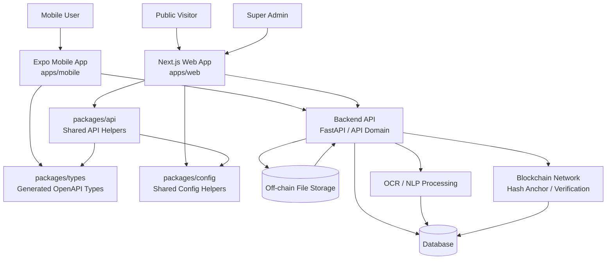

## 2. Route Ownership Split

```mermaid
flowchart LR
  Root[LexChain Monorepo] --> MobileApp[apps/mobile<br/>Expo]
  Root --> WebApp[apps/web<br/>Next.js]
  Root --> Packages[packages]

  MobileApp --> MobileAuth[Auth Routes]
  MobileApp --> MobileDocs[Documents]
  MobileApp --> MobileUpload[Upload / Camera]
  MobileApp --> MobileProcess[Processing]
  MobileApp --> MobileVerify[Mobile Verify<br/>/verify/[id]]
  MobileApp --> MobileProfile[Profile]

  WebApp --> Landing[Landing<br/>/]
  WebApp --> PublicVerify[Public Verifier<br/>/verify]
  WebApp --> PublicCode[Code Verifier<br/>/verify/[code]]
  WebApp --> Invite[Invite Fallback<br/>/invite/[token]]
  WebApp --> Download[Download<br/>/download]
  WebApp --> AdminPortal[Admin Portal<br/>/admin/*]
  WebApp --> LegalPages[Terms / Privacy]

  Packages --> Types[types]
  Packages --> Api[api]
  Packages --> Config[config]
```

## 3. Mobile Authentication Workflow

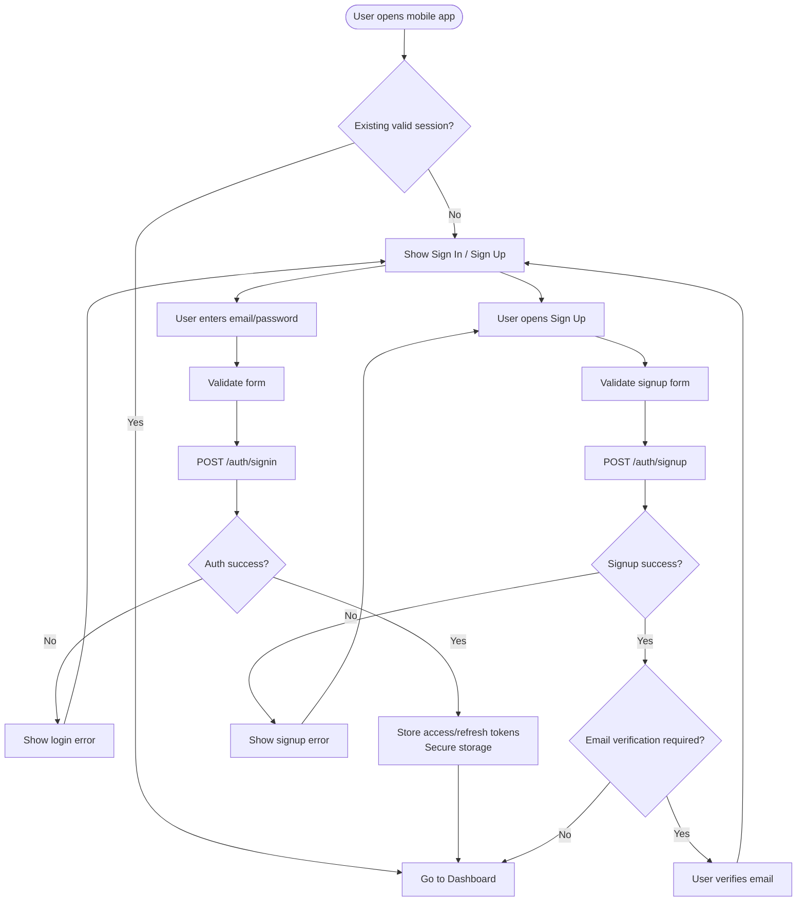

## 4. Invite Link Workflow

```mermaid
flowchart TD
  Backend[Backend creates invitation token] --> Email[Send email link<br/>https://lexchain.app/invite/token]
  Email --> Browser[Recipient opens link in browser]
  Browser --> InvitePage[Next.js Invite Page<br/>/invite/[token]]

  InvitePage --> Choice{User choice}
  Choice --> OpenApp[Open in app]
  Choice --> Download[Download app]
  Choice --> ContinueWeb[Continue on website]

  OpenApp --> DeepLink[lexchain://sign-up?token=token]
  DeepLink --> MobileSignup[Mobile Sign Up receives token]
  MobileSignup --> SubmitSignup[Submit signup with token if backend supports it]
  SubmitSignup --> BackendValidate[Backend validates invitation]

  Download --> DownloadPage[/download]
  ContinueWeb --> AdminOrWeb[Allowed web route]

  BackendValidate --> SignupResult{Valid token?}
  SignupResult -- Yes --> AccountCreated[Create account / grant invite access]
  SignupResult -- No --> InviteError[Show invite error]
```

## 5. Mobile Upload and Processing Workflow


## 6. Document Detail Workflow

```mermaid
flowchart TD
  List[Documents tab] --> Select[User selects document]
  Select --> Detail[/document/[id]]
  Detail --> Fetch[GET /documents/{document_id}]
  Fetch --> Found{Document found and authorized?}
  Found -- No --> Error[Show not found / access error]
  Found -- Yes --> Render[Render detail screen]

  Render --> Summary[Show summary and extracted fields]
  Render --> FileActions[Open PDF / file actions]
  Render --> Versions[Show version history]
  Render --> Permissions[Show parties / whitelist]
  Render --> Blockchain[Show notarization / on-chain status]
  Render --> VerifyAction[Open mobile verifier]

  VerifyAction --> MobileVerify[/verify/[id]]
```

## 7. Mobile Document Verification Workflow

```mermaid
flowchart TD
  Start([User opens /verify/[id]]) --> FetchDoc[Fetch document verification data]
  FetchDoc --> Authorized{Authorized?}
  Authorized -- No --> AccessError[Show access denied]
  Authorized -- Yes --> HashCheck[Backend checks stored hash]

  HashCheck --> ChainCheck[Backend checks blockchain anchor]
  ChainCheck --> Result{Verification result}

  Result -- Match --> Valid[Show valid/authentic]
  Result -- Mismatch --> Tampered[Show tampered/mismatch warning]
  Result -- Pending --> Pending[Show pending/not anchored]
  Result -- Missing --> Unknown[Show unknown/no record]
```

## 8. Public PDF Verification Workflow

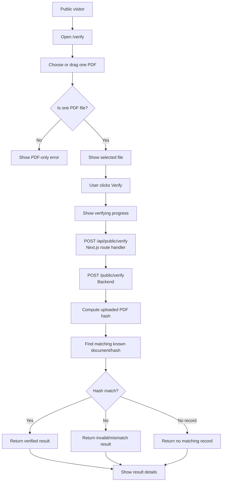

## 9. Public Code Verification Workflow

```mermaid
flowchart TD
  Visitor[Public visitor] --> CodeUrl[Open /verify/[code]]
  CodeUrl --> BackendSupport{Backend has GET /public/verify/{code}?}

  BackendSupport -- Yes --> FetchCode[Fetch code verification]
  FetchCode --> CodeResult{Result}
  CodeResult -- Valid --> ShowValid[Show valid document]
  CodeResult -- Invalid --> ShowInvalid[Show invalid/expired code]
  CodeResult -- Missing --> ShowMissing[Show no record]

  BackendSupport -- No --> Limitation[Show clear limitation]
  Limitation --> PdfFallback[Link to /verify PDF upload]
```

## 10. Admin Login and Session Workflow

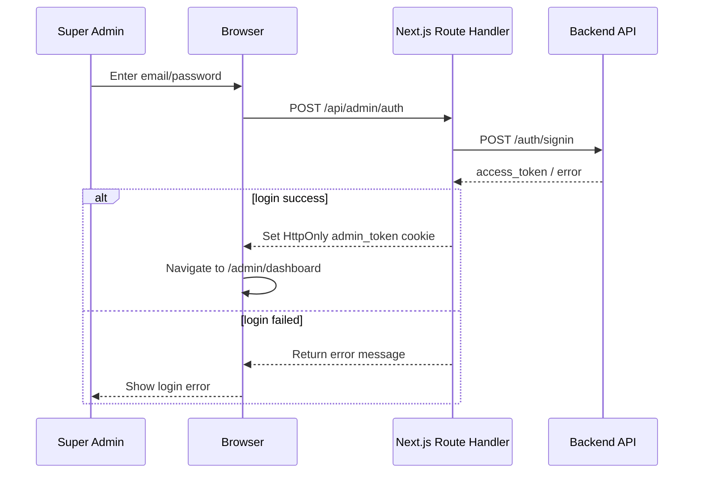

## 11. Admin Dashboard Data Workflow

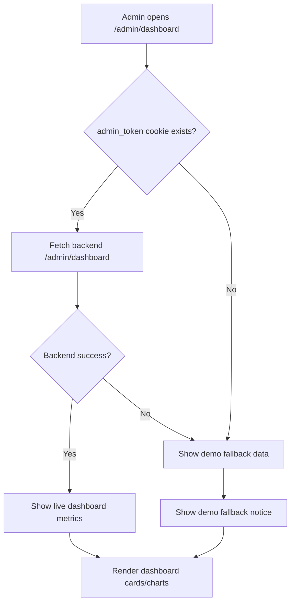

## 12. Admin Page-by-Page Workflow

```mermaid
flowchart TB
  AdminShell[Admin Shell<br/>Sidebar + Content Layout] --> Dashboard[Dashboard]
  AdminShell --> Users[Users]
  AdminShell --> Documents[Documents]
  AdminShell --> Issuers[Document Issuers]
  AdminShell --> Categories[Categories]
  AdminShell --> Invitations[Invitations & Permissions]
  AdminShell --> Verifications[Verification Logs]
  AdminShell --> Blockchain[Blockchain Records]
  AdminShell --> Processing[OCR / NLP Processing]
  AdminShell --> Analytics[Analytics]
  AdminShell --> Audit[Audit Logs]
  AdminShell --> Settings[System Settings]

  Dashboard --> Metrics[Platform Metrics]
  Users --> UserTable[User Table]
  Documents --> DocumentTable[Document Table]
  Issuers --> IssuerTable[Issuer Table]
  Categories --> CategoryRules[Category Rules]
  Invitations --> AccessEvents[Access Events]
  Verifications --> VerificationTable[Verification Attempts]
  Blockchain --> ChainTable[Hash Anchors]
  Processing --> ProcessingTable[Processing Jobs]
  Analytics --> MetricTable[Operational Metrics]
  Audit --> AuditTable[Security/Activity Events]
  Settings --> ConfigTable[System Configuration]
```

## 13. Admin Monitoring Workflow

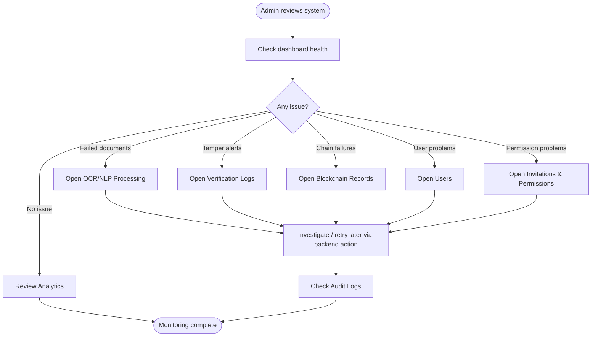

## 14. Shared OpenAPI Type Generation Workflow

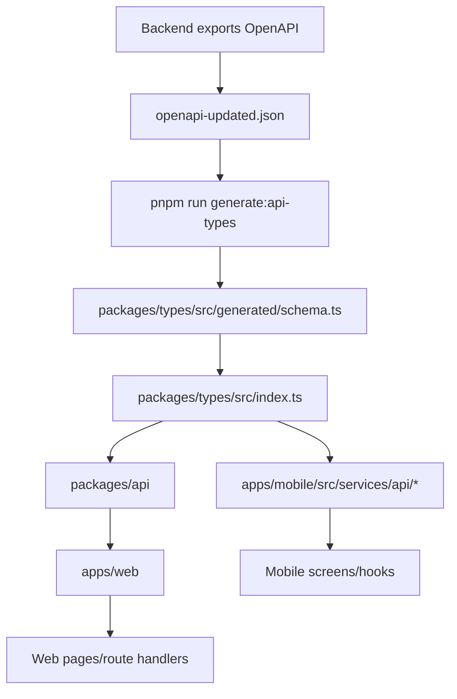

## 15. API Request Flow

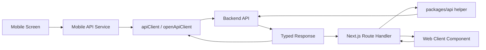

## 16. Public Verifier Sequence Diagram


## 17. Upload and Blockchain Sequence Diagram

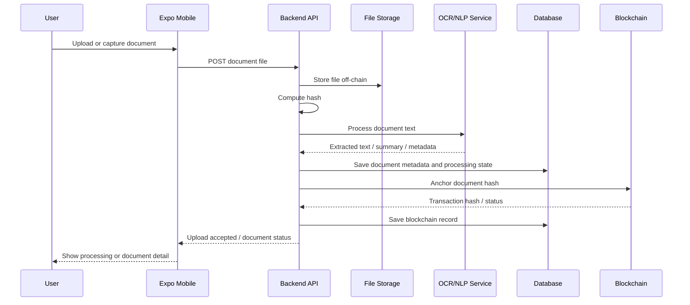

## 18. Deployment Flow

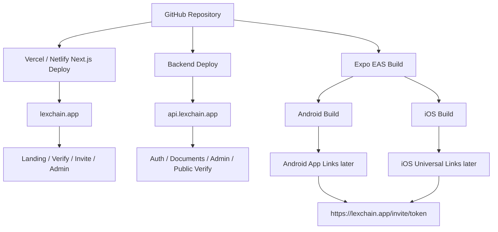

## 19. Security Boundary Diagram

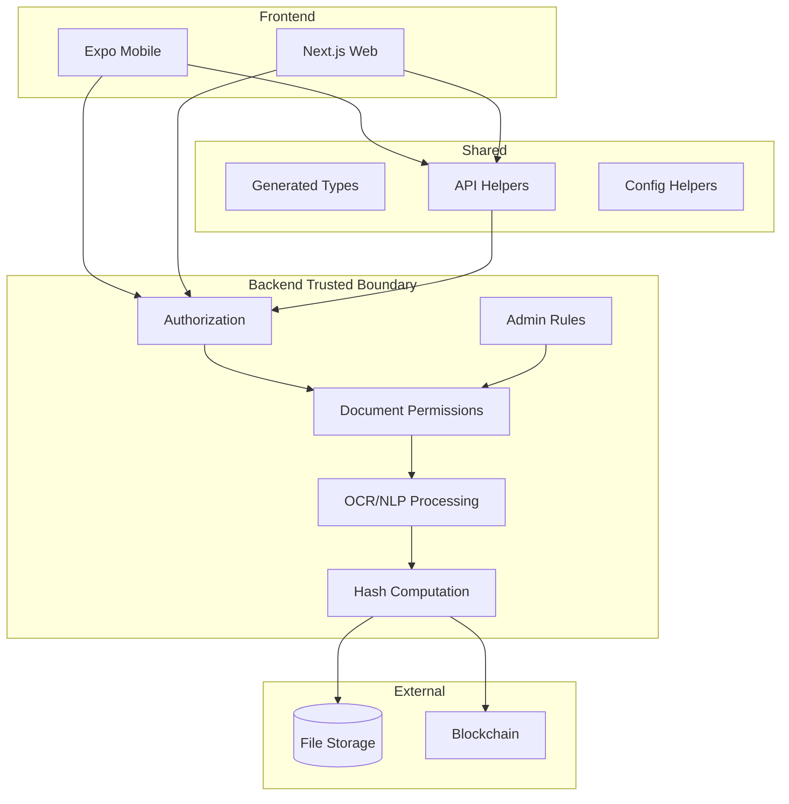

Security rule summary:

```txt
Frontend may request actions.
Backend must authorize actions.
Blockchain may prove integrity.
Blockchain does not prove legal validity.
```

## 20. Current State Summary

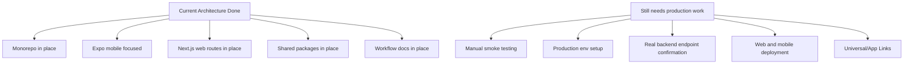
