# LexChain Workflow Flowcharts

Last updated: 2026-07-26

This document contains Mermaid diagrams for the main LexChain workflows. It is meant to support adviser review, developer onboarding, and implementation planning.

## 1. Whole System Architecture

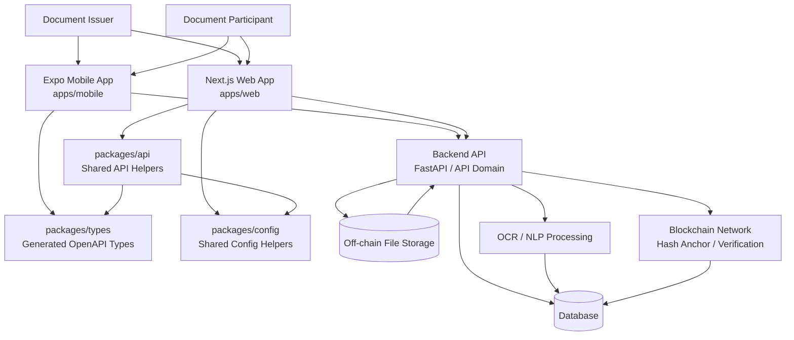

## 2. Route Ownership Split

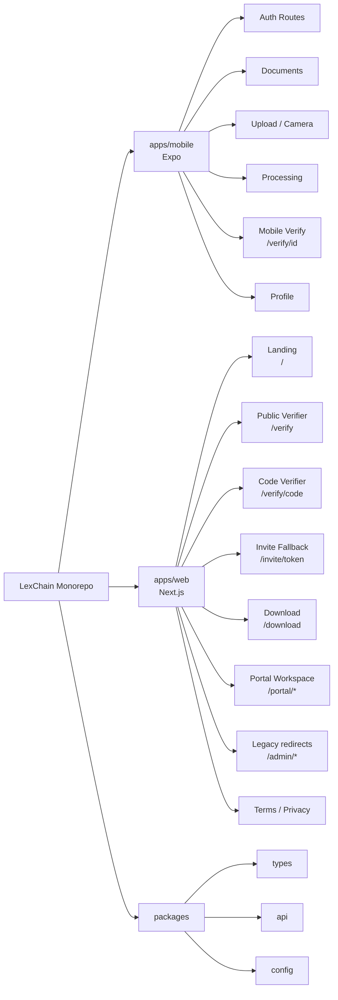

## 3. Mobile Authentication Workflow

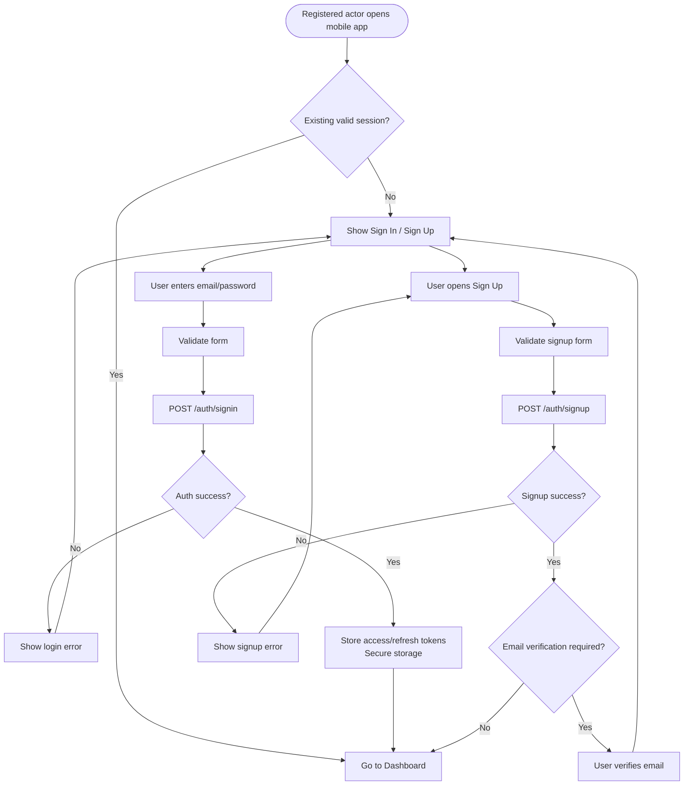

## 4. Invite Link Workflow

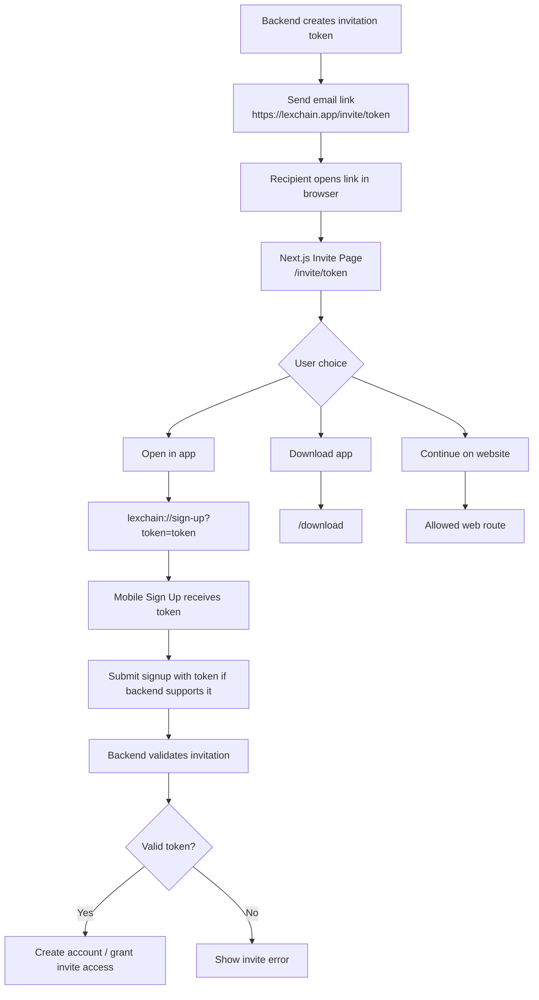

## 5. Mobile Upload and Processing Workflow

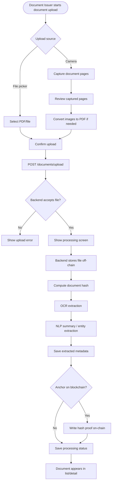

## 6. Document Detail Workflow

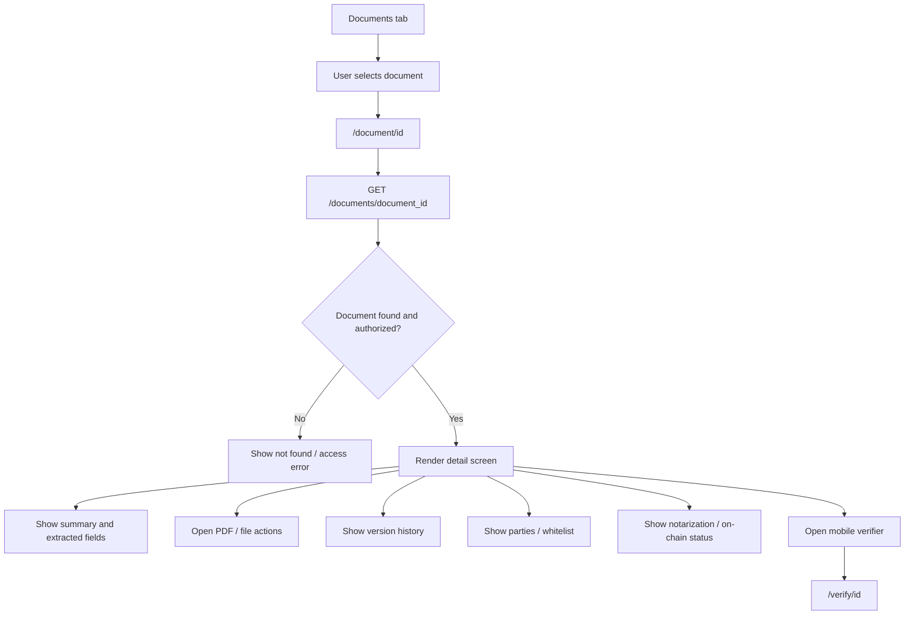

## 7. Mobile Document Verification Workflow

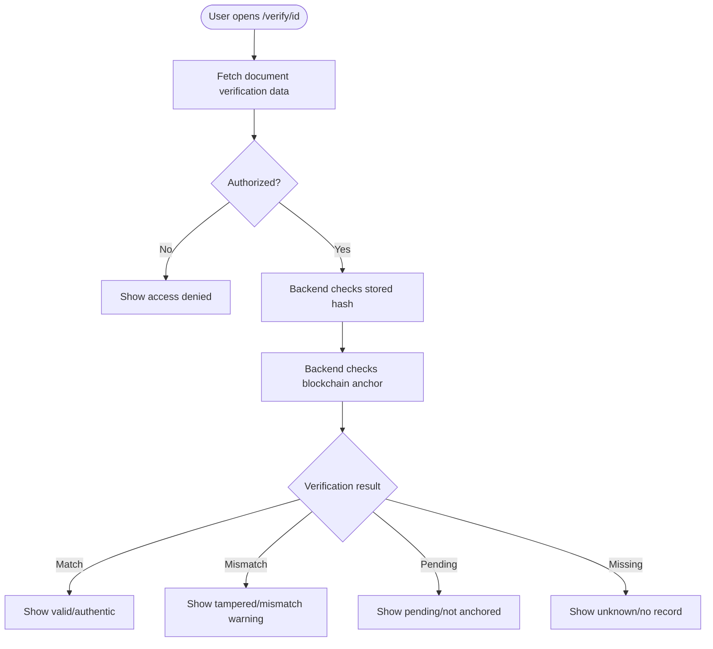

## 8. Public PDF Verification Workflow

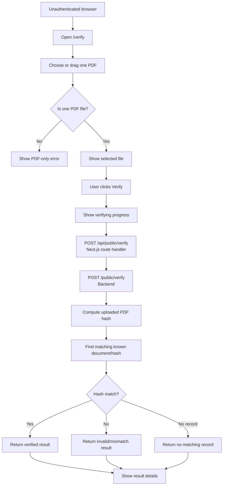

## 9. Public Code Verification Workflow

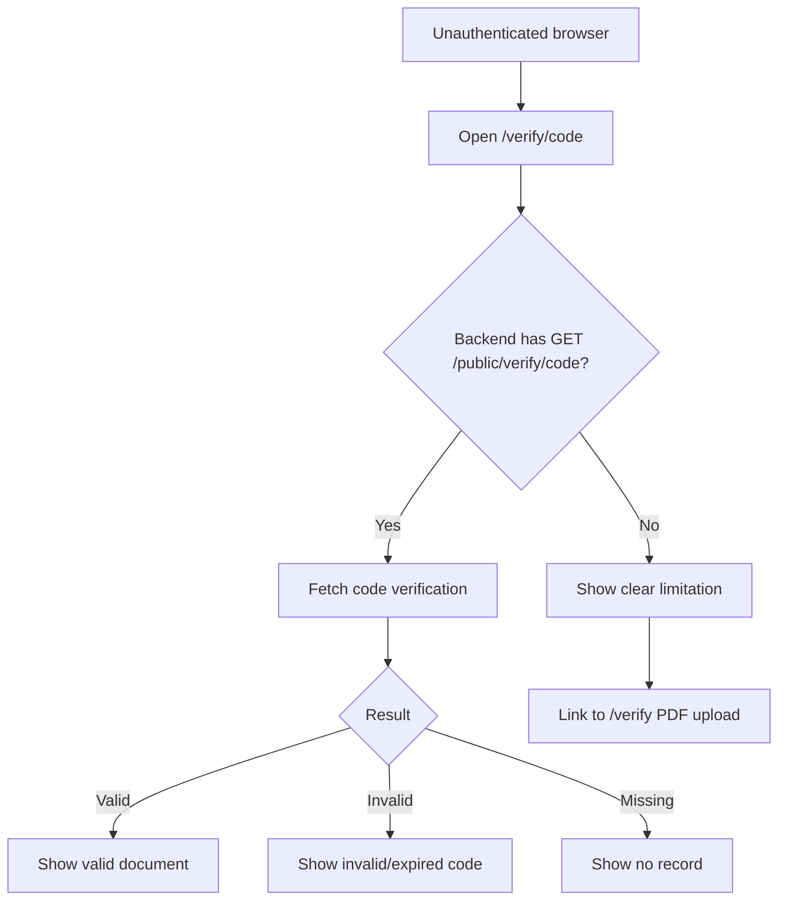

## 10. Portal Login and Issuer Session Workflow

```mermaid
sequenceDiagram
  participant Issuer as Document Issuer
  participant Participant as Document Participant
  participant Browser as Browser
  participant Next as Next.js Route Handler
  participant Backend as Backend API

  alt Document Issuer login
    Issuer->>Browser: Enter email/password
  else Document Participant login
    Participant->>Browser: Enter email/password
  end
  Browser->>Next: POST /api/auth
  Next->>Backend: POST /auth/signin
  Backend-->>Next: authenticated profile / error

  alt document_issuer
    Next-->>Browser: Set HttpOnly portal_token and issuer_token cookies
    Browser->>Browser: Navigate to /portal/dashboard
  else document_participant
    Next-->>Browser: Set HttpOnly portal_token cookie
    Browser->>Browser: Navigate to permitted /portal workspace
  else login failed
    Next-->>Browser: Return error message
    Browser-->>Issuer: Show login error
    Browser-->>Participant: Show login error
  end

  Browser->>Next: POST /api/portal/logout
  Next-->>Browser: Clear portal_token and issuer_token cookies, including stale issuer cookie
```

## 11. Document Issuer System Management Workflow

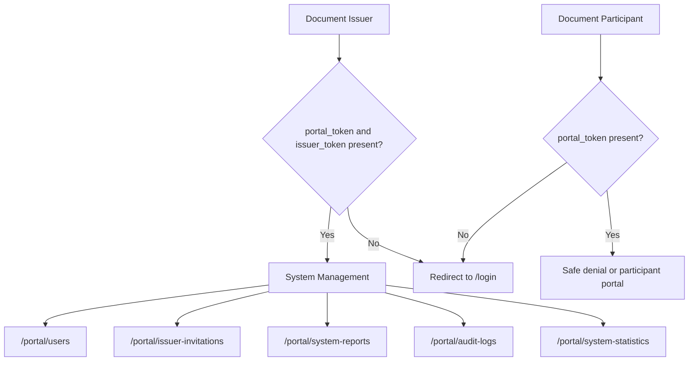

## 12. Shared OpenAPI Type Generation Workflow

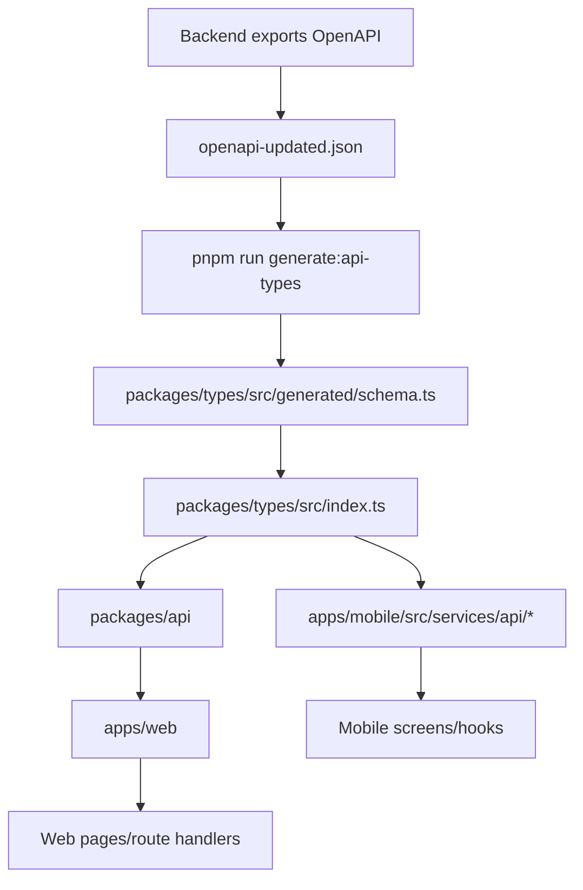

## 13. API Request Flow

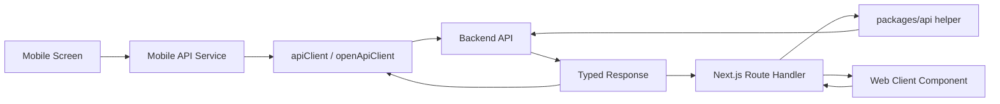

## 14. Public Verifier Sequence Diagram

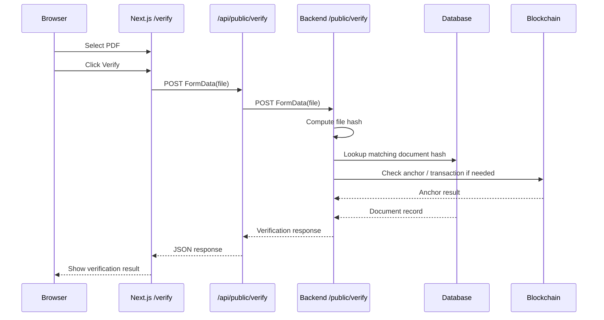

## 15. Upload and Blockchain Sequence Diagram

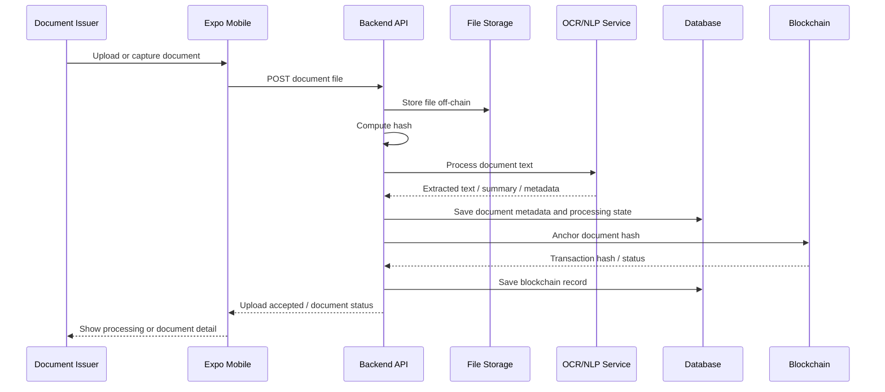

## 16. Deployment Flow

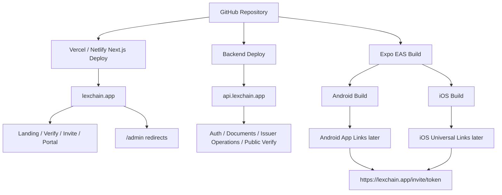

## 17. Security Boundary Diagram

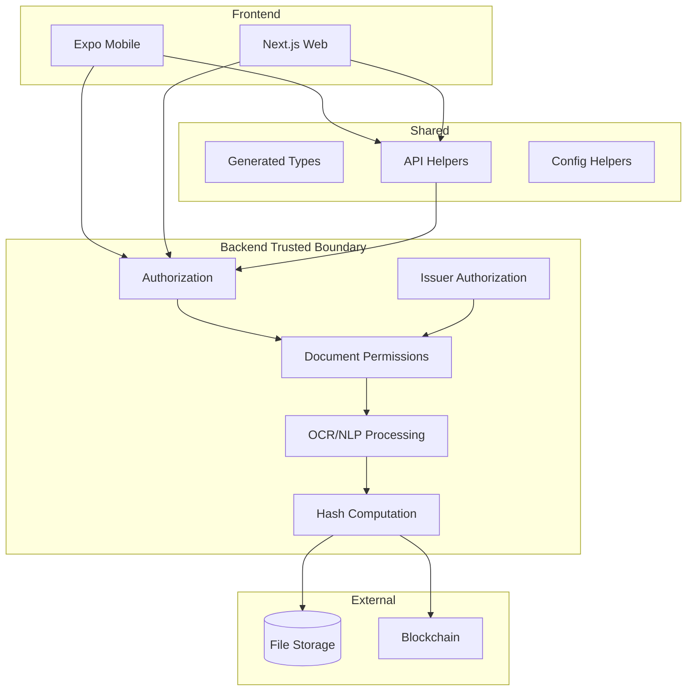

Security rule summary:

```txt
Frontend may request actions.
Backend must authorize actions.
Blockchain may prove integrity.
Blockchain does not prove legal validity.
```

## 18. Current State Summary

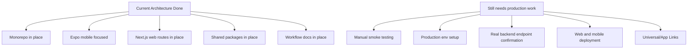
